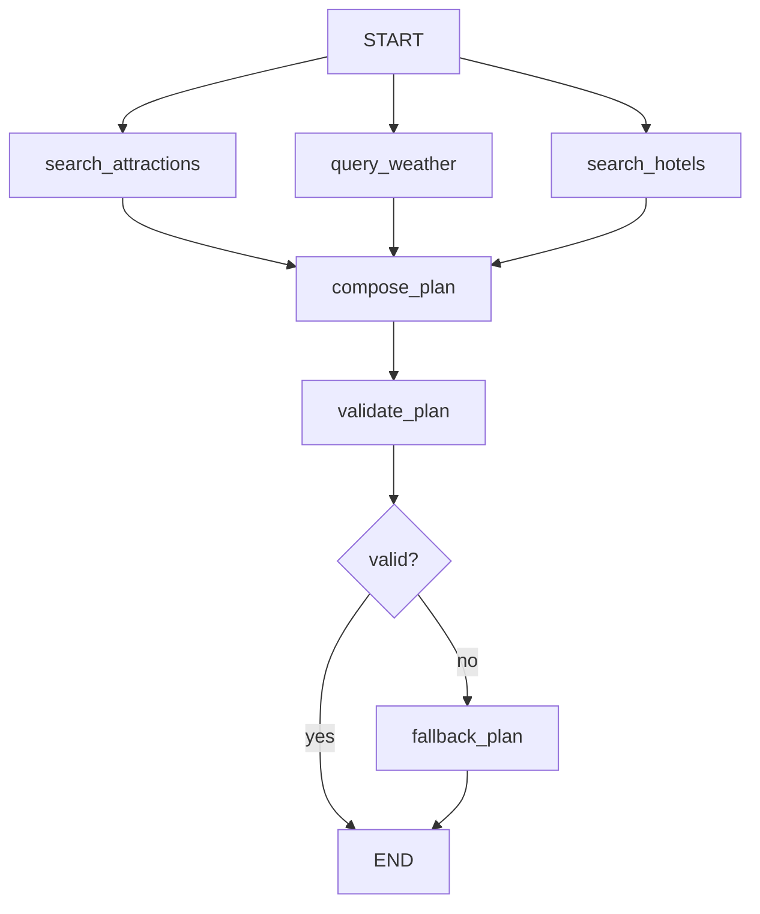

# LangGraph Trip Planner

一个学习向的多智能体旅行规划项目。前端使用 Vue 3，后端重写为 LangChain / LangGraph 架构，通过高德地图 MCP 工具辅助生成多日旅行计划。

> 当前仓库以 `backend-re` 为后端实现；原 `backend` 目录是旧 HelloAgents 实现，已在 Git 中忽略，不作为本次提交内容。

## 功能概览

- 多智能体旅行规划：景点搜索、天气查询、酒店推荐、行程汇总。
- LangGraph 并行编排：景点、天气、酒店三个节点并行执行。
- LangChain 工具调用：前三个节点仍由 LLM 自主决定是否调用高德 MCP 工具。
- 结构化输出：最终行程输出为 Pydantic `TripPlan`，便于前端消费。
- 前后端分离：Vue 3 + TypeScript 前端调用 FastAPI 后端。

## 技术栈

### 后端 `backend-re`

- FastAPI
- LangChain
- LangGraph
- langchain-mcp-adapters
- langchain-openai
- 高德地图 MCP Server
- Pydantic v2

### 前端 `frontend`

- Vue 3
- TypeScript
- Vite
- Ant Design Vue
- Axios
- 高德地图 JavaScript API

## 项目结构

```text
helloagents-trip-planner/
├── backend-re/                 # LangChain / LangGraph 重写后端
│   ├── app/
│   │   ├── agents/
│   │   │   └── trip_planner_graph.py
│   │   ├── api/
│   │   │   ├── main.py
│   │   │   └── routes/
│   │   │       └── trip.py
│   │   ├── models/
│   │   │   └── schemas.py
│   │   ├── services/
│   │   │   ├── llm_service.py
│   │   │   └── mcp_service.py
│   │   └── config.py
│   ├── requirements.txt
│   ├── .env.example
│   └── run.py
├── frontend/                   # Vue 前端
│   ├── src/
│   ├── package.json
│   └── vite.config.ts
├── backend/                    # 旧实现，Git 忽略
├── .gitignore
└── README.md
```

## LangGraph 流程



## 后端启动

进入重写后端目录：

```bash
cd backend-re
```

安装依赖：

```bash
pip install -r requirements.txt
```

创建环境变量文件：

```bash
copy .env.example .env
```

填写 `.env`：

```env
LLM_MODEL_ID=your-model-name
LLM_API_KEY=your-api-key
LLM_BASE_URL=your-openai-compatible-base-url
LLM_TIMEOUT=60
AMAP_API_KEY=your-amap-api-key
```

启动服务：

```bash
python run.py
```

API 文档：

```text
http://localhost:8000/docs
```

主要接口：

```text
POST /api/trip/plan
GET  /api/trip/health
GET  /health
```

## 前端启动

进入前端目录：

```bash
cd frontend
```

安装依赖：

```bash
npm install
```

启动开发服务：

```bash
npm run dev
```

默认访问：

```text
http://localhost:5173
```

如需指定后端地址，可在 `frontend/.env` 中配置：

```env
VITE_API_BASE_URL=http://localhost:8000
```

## 核心实现说明

后端入口在 `backend-re/app/agents/trip_planner_graph.py`。

- `search_attractions`: 景点搜索专家，使用高德 MCP 搜索景点信息。
- `query_weather`: 天气查询专家，使用高德 MCP 查询天气。
- `search_hotels`: 酒店推荐专家，使用高德 MCP 搜索酒店。
- `compose_plan`: 行程规划专家，汇总上游结果并生成结构化 `TripPlan`。
- `validate_plan`: 校验城市、天数、餐饮和景点信息。
- `fallback_plan`: 当结构化输出或校验失败时生成备用计划。

## 环境变量

| 名称 | 说明 |
| --- | --- |
| `LLM_MODEL_ID` | OpenAI-compatible 模型名称 |
| `LLM_API_KEY` | LLM API Key |
| `LLM_BASE_URL` | LLM API Base URL |
| `LLM_TIMEOUT` | LLM 超时时间 |
| `AMAP_API_KEY` | 高德地图 Web 服务 API Key |
| `HOST` | 后端监听地址 |
| `PORT` | 后端端口 |
| `CORS_ORIGINS` | 允许跨域的前端地址 |

## 说明

这是学习 LangChain / LangGraph 多智能体编排的示例项目。实现上刻意保留了“多个专家 Agent 分工协作”的形式，便于观察节点状态、工具调用和最终结构化输出之间的关系。
