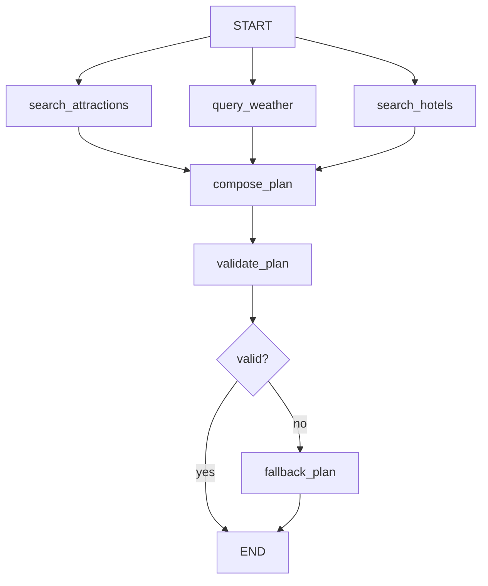

# LangChain / LangGraph Backend Rewrite

这是旅行规划后端的独立重写版本，不修改原 `backend` 目录。

## 设计目标

- 使用 LangGraph 显式编排多智能体流程。
- 使用 LangChain tool-calling agent 让 LLM 自主决定是否调用高德 MCP 工具。
- 参考原始代码逻辑：景点搜索、天气查询、酒店搜索、行程规划。
- 景点、天气、酒店三个节点并行执行。
- 对外 API 保持 `/api/trip/plan`，响应结构保持 `TripPlanResponse`。

## 流程



## 安装

```bash
cd backend-re
pip install -r requirements.txt
cp .env.example .env
```

编辑 `.env`：

```env
LLM_MODEL_ID=your-model-name
LLM_API_KEY=your-api-key
LLM_BASE_URL=your-openai-compatible-base-url
AMAP_API_KEY=your-amap-key
```

## 启动

```bash
python run.py
```

或：

```bash
uvicorn app.api.main:app --reload --host 0.0.0.0 --port 8000
```

API 文档：

```text
http://localhost:8000/docs
```

## 关键文件

- `app/agents/trip_planner_graph.py`: LangGraph 多智能体主流程。
- `app/services/llm_service.py`: LangChain ChatOpenAI 模型工厂。
- `app/services/mcp_service.py`: LangChain MCP adapter 加载高德 MCP 工具。
- `app/models/schemas.py`: 与原后端兼容的 Pydantic 响应模型。
- `app/api/routes/trip.py`: 旅行规划 API。
